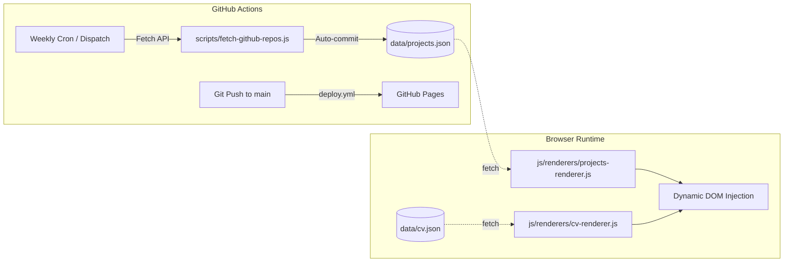

# Jonathan Maier — Personal Website & Portfolio

[](https://jonnycap.github.io/Personal-Website/)
[](https://developer.mozilla.org/en-US/docs/Web/JavaScript)
[](LICENSE)

> A fast, interactive, and lightweight personal portfolio and project showcase built from scratch using pure Vanilla Web technologies.

---

## 🌟 Overview

This project is a personal portfolio built without external UI frameworks or static site generators. It demonstrates core web engineering principles through a custom vanilla JavaScript Single-Page Application (SPA) architecture, interactive HTML5 Canvas visualizers, modular JSON-driven content rendering, and automated GitHub Actions workflows.

---

## 🔄 What's Changed Since v1 (2022 → August 15, 2026)

Since its original release in 2022, the website has been significantly overhauled:

- **GitHub Actions Integration & Automated Sync**: Added an automated GitHub Actions cron workflow that queries the GitHub API to dynamically update public repositories into `data/projects.json`.
- **JSON-Driven CV & Project Loading**: Replaced hardcoded HTML markup with structured data (`data/cv.json`, `data/projects.json`), dynamically parsed and rendered client-side (`js/renderers/cv-renderer.js`, `js/renderers/projects-renderer.js`).
- **Animation & Canvas Optimization**: Refactored particle loops, render cycles, and DPI scaling across all canvas scripts for lower CPU/GPU usage and smoother frame rates.
- **Frontend & Mobile Layout Fixes**: Fixed responsive layout bugs, viewport height clipping on mobile devices, navbar animations, and touch-friendly interaction states.
- **Automated CI/CD Pipeline**: Streamlined GitHub Pages deployment via GitHub Actions on every push to `main`.

---

## 🔄 GitHub Actions & Data Flow



---

## ⚙️ Core Architecture & Features

- **Custom SPA Engine** (`js/core/router.js`): Dynamic multi-section routing and fluid tab navigation on the deep-dive page (`about.html`) without page reloads.
- **Dynamic Content Modules** (`js/renderers/cv-renderer.js`, `js/renderers/projects-renderer.js`): Client-side async rendering from structured JSON data.
- **Interactive HTML5 Canvases** (`js/canvas/weather-canvas.js`, `js/canvas/cloud-canvas.js`, `js/canvas/timeline-canvas.js`): 3-Stage atmospheric & technical simulation (Cloud Vapor & Isobars, Digital Rain Matrix & Umbrella Shield, Procedural Fractal Lightning), interactive trajectory milestones, and DPI-responsive backgrounds.
- **Custom UI Components** (`js/components/project-slider.js`, `js/components/navbar.js`, `js/components/scroll-effects.js`, `js/components/scroll-button.js`): Touch-enabled carousel, sticky responsive navigation, floating scroll indicators, and in-place crossfade scroll transitions.
- **Form Handling & App State** (`js/core/navigation.js`): Asynchronous contact and newsletter submission powered by FormSubmit, responsive viewport adapters, and page state persistence.

---

## 📁 Project Structure

```text
Personal-Website/
├── .github/
│   └── workflows/
│       ├── deploy.yml               # Automated deployment to GitHub Pages
│       └── fetch-repos.yml          # Weekly sync for public GitHub repositories
├── css/                             # Stylesheets
│   ├── about.css                    # Subpage SPA layout, timelines, and tabs
│   ├── home.css                     # Landing page & hero section styles
│   └── nav-footer.css               # Global navbar and footer styles
├── data/
│   ├── cv.json                      # Structured resume/CV data
│   ├── projectConfig.json           # Repository blacklist & custom project metadata
│   └── projects.json                # Cached repository data fetched from GitHub
├── images/                          # Optimized WebP assets & icons
├── js/                              # Client-side JavaScript modules
│   ├── canvas/                      # HTML5 Canvas visual & particle simulation engines
│   │   ├── cloud-canvas.js          # Atmospheric particle cloud canvas
│   │   ├── timeline-canvas.js       # Milestone timeline connector canvas
│   │   └── weather-canvas.js        # 3-Stage interactive weather simulation
│   ├── components/                  # UI interactive components & transitions
│   │   ├── navbar.js                # Sticky navigation & responsive dropdown
│   │   ├── project-slider.js        # Touch/click project slider
│   │   ├── scroll-button.js         # Animated scroll trigger & particle canvas
│   │   └── scroll-effects.js        # Dynamic in-place hero scroll crossfade
│   ├── core/                        # Application routing, navigation & state
│   │   ├── navigation.js            # App routing helper, storage & contact form
│   │   └── router.js                # SPA hash router & section switcher
│   └── renderers/                   # Dynamic JSON-to-DOM renderers
│       ├── cv-renderer.js           # Client-side CV renderer
│       └── projects-renderer.js     # Projects grid renderer
├── scripts/                         # Automation & CI/CD tooling (Node.js)
│   └── fetch-github-repos.js        # Node.js GitHub API sync script
├── index.html                       # Landing page
├── about.html                       # Interactive deep-dive portfolio (SPA)
└── README.md
```

---

## 🛠️ Tech Stack

- **Frontend**: HTML5, Vanilla CSS3, Vanilla JavaScript (ES6+)
- **Data & Rendering**: JSON-driven async DOM rendering
- **Graphics**: HTML5 Canvas API (Custom particle & vector engines)
- **Automation / CI/CD**: GitHub Actions (repo sync cron + Pages deployment)
- **Forms**: [FormSubmit](https://formsubmit.co/) API

---

## 🚀 Getting Started

No build step or package manager is required for local preview.

### Local Preview

1. **Clone the repository:**
   ```bash
   git clone https://github.com/jonnyCap/Personal-Website.git
   cd Personal-Website
   ```

2. **Run a local web server:**
   ```bash
   # Using Python 3
   python3 -m http.server 8000

   # Or using Node.js
   npx serve .
   ```
3. Open `http://localhost:8000` in your browser.

---

## 📬 Contact & Links

- **Author**: Jonathan Maier
- **Portfolio**: [jonnycap.github.io/Personal-Website](https://jonnycap.github.io/Personal-Website/)
- **GitHub**: [@jonnyCap](https://github.com/jonnyCap)
- **LinkedIn**: [Jonathan Maier](https://www.linkedin.com/in/jonathan-maier-179836263/)

